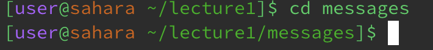
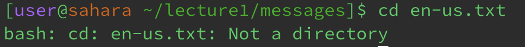
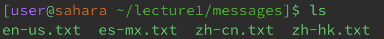
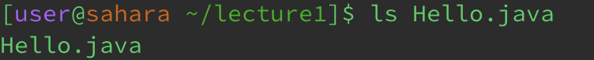
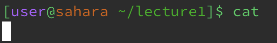
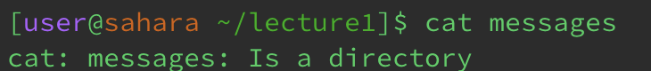
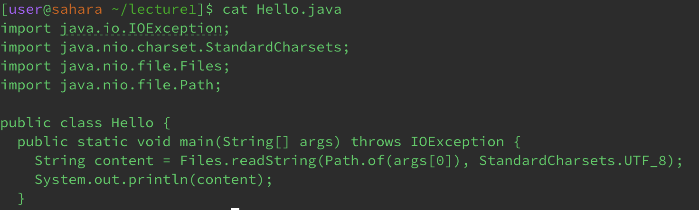

# Lab Report 1

## Using cd

1) Share an example of using the command with no arguments.

Working directory: /home/lecture1

No output because it successfully changed to the home directory.

Output is not an error.

&nbsp;
&nbsp;

2) Share an example of using the command with a path to a directory as an argument.

Working directory: /home/lecture1

No output as it successfully changed the working directory to /home/lecture1/messages.

Output is not an error

 

3) Share an example of using the command with a path to a file as an argument.

Working directory: /home/lecture1/messages

Got output because en-us.txt is not a directory, cannot change working directory into that.

Output is an error, because en-us.txt is not a directory.

 

## Using ls

1) Share an example of using the command with no arguments.

Working directory: /home/lecture1/messages

Output shows all the files that are in the working directory.

Output is not an error.

 

2) Share an example of using the command with a path to a directory as an argument.

Working directory: /home/lecture1

Output lists all files in the directory passed as an argument.

Output is not an error.

 

3) Share an example of using the command with a path to a file as an argument.

Working directory: /home/lecture1

Output lists the file that is passed as an argument.

Output is not an error.

 

## Using cat

1) Share an example of using the command with no arguments.

Working directory: /home/lecture1

The command line hangs because there is no file to read from.

Output is not exactly an error.

 

2) Share an example of using the command with a path to a directory as an argument.

Working directory: /home/lecture1

Output is an error message saying messages is a directory, as it cannot read the directory itself.

Output is an error, because messages is a directory and not a file.

 

3) Share an example of using the command with a path to a file as an argument.

Working directory: /home/lecture1

The command reads and displays the contents of the specified file as output, in this case Hello.java.

Output is not an error.
