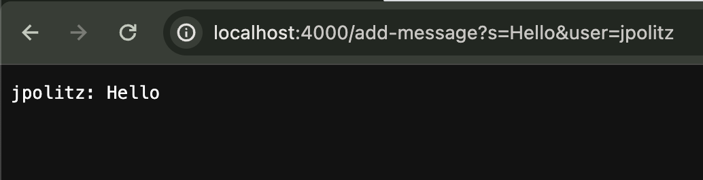
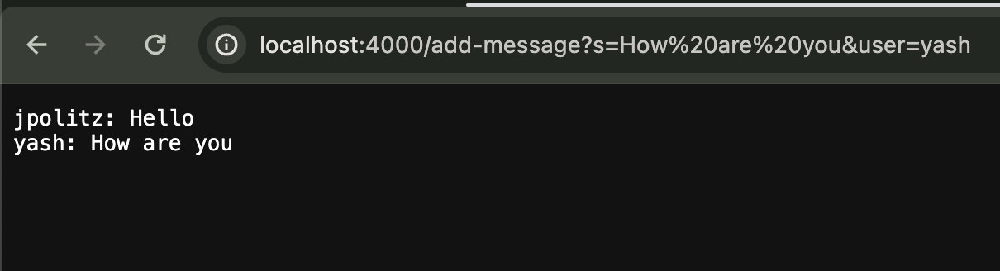
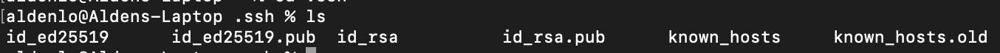
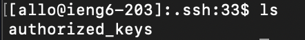
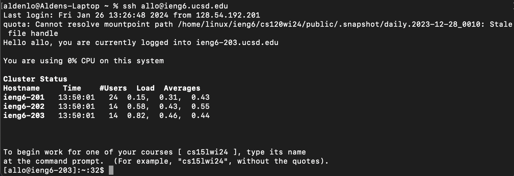

# Lab Report 2

## Part 1 - ChatServer

Here is the code to my ChatServer:
```
import java.io.IOException;
import java.net.URI;

class Handler implements URLHandler {
    String chatStr = "";

    public String handleRequest(URI url) {
        if (url.getPath().equals("/")) {
            return chatStr;
        } else if (url.getPath().equals("/add-message")) {
            String[] queries = url.getQuery().split("&");

            
            String msg = queries[0].split("s=")[1];
            String user = queries[1].split("user=")[1];
        
            chatStr += user + ": " + msg + "\n";

            return chatStr;
        } 
        
        return "404 Not Found!";
        
    }
}

class ChatServer {
    public static void main(String[] args) throws IOException {
        if(args.length == 0){
            System.out.println("Missing port number! Try any number between 1024 to 49151");
            return;
        }

        int port = Integer.parseInt(args[0]);

        Server.start(port, new Handler());
    }
}
```


This first calls the `handleRequest` method of the `Handler` class. 
It then calls the `getPath` method on the URL to see if the path string is equal to `"/add-message"` using the `equals` method.
If it is, then `getQuery` gets called on the URL to retrieve the query string, and I use `split` method at the `"&"` to divide the two queries.
Afterwards, I save the message and the user strings into variables by calling `split` on each query at `"s="` and `"user="` respectively.

&nbsp;

`handleRequest` takes in the URL as an URI object.

`getPath` takes no arguments.

`getQuery` takes no arguments.

`equals` takes in `"/add-message"` to compare with.

`split` takes in a String to split at, which are `"&"`, `"s="`, `"user="`.

`chatStr` field is a String that saves the all messages added, and is empty originally.

&nbsp;

After this specific request, the `chatStr` field gets updated into `"jpolitz: Hello\n"`.


This first calls the `handleRequest` method of the `Handler` class. 
It then calls the `getPath` method on the URL to see if the path string is equal to `"/add-message"` using the `equals` method.
If it is, then `getQuery` gets called on the URL to retrieve the query string, and I use `split` method at the `"&"` to divide the two queries.
Afterwards, I save the message and the user strings into variables by calling `split` on each query at `"s="` and `"user="` respectively.

&nbsp;

`handleRequest` takes in the URL as an URI object.

`getPath` takes no arguments.

`getQuery` takes no arguments.

`equals` takes in `"/add-message"` to compare with.

`split` takes in a String to split at, which are `"&"`, `"s="`, `"user="`.

`chatStr` field is a String that saves the all messages added, and is empty originally.

&nbsp;

After this specific request, the `chatStr` field gets updated into `"jpolitz: Hello\nyash: How are you\n"`.

## Part 2 - SSH Key

### Private Key


The absolute path to the private key is `/Users/aldenlo/.ssh/id_rsa`

&nbsp;
&nbsp;

### Public Key


The absolute path to the public key is `/home/linux/ieng6/oce/75/675/allo/.ssh/authorized_keys`

&nbsp;
&nbsp;

### Logging Into ieng6 Without Password


&nbsp;
&nbsp;

## Part 3 - What I've learnt
