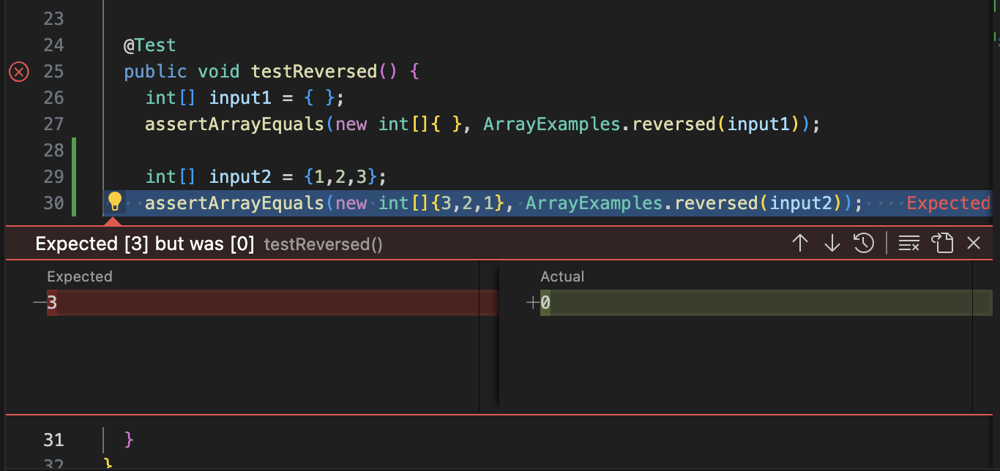

# Lab Report 3

## Part 1 - Bugs

The method I'm testing is the `ArrayList` `reversed()` method.

### Failure Input

```
@Test
  public void testReversed() {
    int[] input1 = {1,2,3};
    assertArrayEquals(new int[]{3,2,1}, ArrayExamples.reversed(input1));
  }
```

### No Failure Input

```
@Test
  public void testReversed() {
    int[] input2 = { };
    assertArrayEquals(new int[]{ }, ArrayExamples.reversed(input2));
  }
```

### Symptom



### Bug

Before:
```
static int[] reversed(int[] arr) {
    int[] newArray = new int[arr.length];
    for(int i = 0; i < arr.length; i += 1) {
        arr[i] = newArray[arr.length - i - 1];
    }
    return newArray;
  }
```

After:
```
static int[] reversed(int[] arr) {
    int[] newArray = new int[arr.length];
    for(int i = 0; i < arr.length; i += 1) {
      newArray[i] = arr[arr.length - i - 1];
    }
    return newArray;
  }
```

The fix addresses the issue as the old code overwrites the original array with the new array populated
with only 0s. The fix switches that around so that it is the new array that is being edited, not the original one.

&nbsp;
&nbsp;

## Part 2 - Researching Commands

### `-N`

This option shows the line numbers of the specified file.

This is useful to reference a particular line in a file and be able to quickly look up which it is without needing to open it.

`less -N find-results.txt`

```
      1 technical/plos
      2 technical/plos/pmed.0020273.txt
      3 technical/plos/journal.pbio.0030032.txt
      4 technical/plos/pmed.0020065.txt
      5 technical/plos/pmed.0020071.txt
      6 technical/plos/pmed.0020059.txt
      7 technical/plos/pmed.0010039.txt
      8 technical/plos/journal.pbio.0020354.txt
      9 technical/plos/pmed.0010010.txt
     10 technical/plos/journal.pbio.0020156.txt
     11 technical/plos/pmed.0020104.txt
     12 technical/plos/pmed.0020272.txt
     13 technical/plos/pmed.0020258.txt
     14 technical/plos/pmed.0020099.txt
     15 technical/plos/journal.pbio.0020140.txt
     16 technical/plos/journal.pbio.0020183.txt
     17 technical/plos/journal.pbio.0020430.txt
     18 technical/plos/journal.pbio.0020394.txt
     19 technical/plos/journal.pbio.0020431.txt
     20 technical/plos/journal.pbio.0020419.txt
     ...
```

`less -N DocSearchServer.java`

```
      1 import java.io.File;
      2 import java.io.IOException;
      3 import java.net.URI;
      4 import java.net.URISyntaxException;
      5 import java.net.InetAddress;
      6 import java.nio.file.Files;
      7 import java.nio.file.Path;
      8 import java.nio.file.Paths;
      9 import java.util.ArrayList;
     10 import java.util.List;
     11 import java.util.Collections;
     12 
     13 class FileHelpers {
     14     static List<File> getFiles(Path start) throws IOException {
     15         File f = start.toFile();
     16         List<File> result = new ArrayList<>();
     17         if(f.isDirectory()) {
     18             File[] paths = f.listFiles();
     19             for(File subFile: paths) {
     20                 result.addAll(getFiles(subFile.toPath()));
     21             }
     22         }
     23         else {
     24             result.add(start.toFile());
     25         }
     26         return result;
     27     }
     28     static String readFile(File f) throws IOException {
     29         return new String(Files.readAllBytes(f.toPath()));
     30     }
     31 }
     ...
```

[Source](https://linuxize.com/post/less-command-in-linux/)

&nbsp;

### `-X`

This option leaves the output in the terminal screen.

This is useful to refer back to when doing other command line operations to avoid needing two terminal windows
or executing the `less` command multiple times.

`less -X find-results.txt`

```
aldenlo@Aldens-Laptop docsearch % less -X find-results.txt   
technical/plos
technical/plos/pmed.0020273.txt
technical/plos/journal.pbio.0030032.txt
technical/plos/pmed.0020065.txt
technical/plos/pmed.0020071.txt
technical/plos/pmed.0020059.txt
technical/plos/pmed.0010039.txt
technical/plos/journal.pbio.0020354.txt
technical/plos/pmed.0010010.txt
technical/plos/journal.pbio.0020156.txt
technical/plos/pmed.0020104.txt
technical/plos/pmed.0020272.txt
technical/plos/pmed.0020258.txt
technical/plos/pmed.0020099.txt
technical/plos/journal.pbio.0020140.txt
...
```

`less -X DocSearchServer.java`

```
aldenlo@Aldens-Laptop docsearch % less -X DocSearchServer.java
import java.io.File;
import java.io.IOException;
import java.net.URI;
import java.net.URISyntaxException;
import java.net.InetAddress;
import java.nio.file.Files;
import java.nio.file.Path;
import java.nio.file.Paths;
import java.util.ArrayList;
import java.util.List;
import java.util.Collections;

class FileHelpers {
    static List<File> getFiles(Path start) throws IOException {
        File f = start.toFile();
        List<File> result = new ArrayList<>();
        if(f.isDirectory()) {
            File[] paths = f.listFiles();
...
```

[Source](https://linuxize.com/post/less-command-in-linux/)

&nbsp;

### `-F`

This option shows file contents directly on terminal if the entire file can be shown on the first screen.

This is useful to save having to press 'q' and refer to other command line operations if the file is really short.

`less -F find-results.txt`

```
technical/plos
technical/plos/pmed.0020273.txt
technical/plos/journal.pbio.0030032.txt
technical/plos/pmed.0020065.txt
technical/plos/pmed.0020071.txt
technical/plos/pmed.0020059.txt
technical/plos/pmed.0010039.txt
technical/plos/journal.pbio.0020354.txt
technical/plos/pmed.0010010.txt
technical/plos/journal.pbio.0020156.txt
technical/plos/pmed.0020104.txt
technical/plos/pmed.0020272.txt
technical/plos/pmed.0020258.txt
technical/plos/pmed.0020099.txt
technical/plos/journal.pbio.0020140.txt
technical/plos/journal.pbio.0020183.txt
technical/plos/journal.pbio.0020430.txt
technical/plos/journal.pbio.0020394.txt
technical/plos/journal.pbio.0020431.txt
technical/plos/journal.pbio.0020419.txt
technical/plos/pmed.0010013.txt
...
```

`less -F count-txts.sh`

```
aldenlo@Aldens-Laptop docsearch % less -F count-txts.sh
find $1 > find-results.txt
grep ".txt" find-results.txt > grep-results.txt
wc grep-results.txt
```
[Source](https://phoenixnap.com/kb/less-command-in-linux)

&nbsp;

### `-m`

This option shows the percentage into the file contents.

This is useful to approximately gauge how many lines there are left when scrolling through.

`less -m find-results.txt`

```
technical/plos
technical/plos/pmed.0020273.txt
technical/plos/journal.pbio.0030032.txt
technical/plos/pmed.0020065.txt
technical/plos/pmed.0020071.txt
technical/plos/pmed.0020059.txt
technical/plos/pmed.0010039.txt
technical/plos/journal.pbio.0020354.txt
technical/plos/pmed.0010010.txt
technical/plos/journal.pbio.0020156.txt
technical/plos/pmed.0020104.txt
technical/plos/pmed.0020272.txt
technical/plos/pmed.0020258.txt
technical/plos/pmed.0020099.txt
technical/plos/journal.pbio.0020140.txt
technical/plos/journal.pbio.0020183.txt
technical/plos/journal.pbio.0020430.txt
6%
```

`less -m DocSearchServer.java`

```
import java.io.File;
import java.io.IOException;
import java.net.URI;
import java.net.URISyntaxException;
import java.net.InetAddress;
import java.nio.file.Files;
import java.nio.file.Path;
import java.nio.file.Paths;
import java.util.ArrayList;
import java.util.List;
import java.util.Collections;

class FileHelpers {
    static List<File> getFiles(Path start) throws IOException {
        File f = start.toFile();
        List<File> result = new ArrayList<>();
        if(f.isDirectory()) {
DocSearchServer.java 19%
```
[Source](https://phoenixnap.com/kb/less-command-in-linux)
