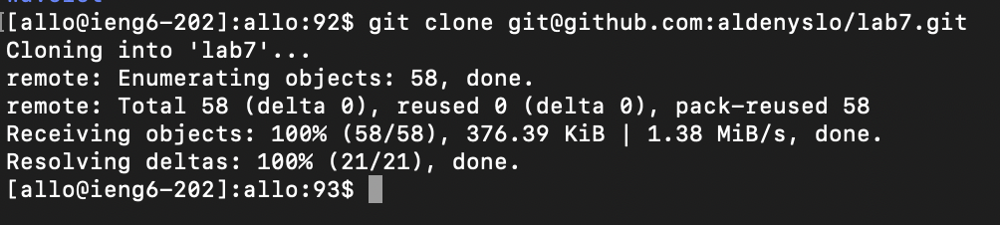

# Lab Report 4

## Log into ieng6

I typed `ssh allo@ieng6.ucsd.edu<enter>` to get into ieng6.
After it connected, I double clicked on the `cs15lwi24` in the suggestion prompt, pressed `<Cmd+C>` to copy, 
clicked back into the input, and pressed `<Cmd+V><enter>` to work on the CSE15L course.

## Clone your fork of the repository from your Github account (using the SSH URL)

I copied the ssh URL from GitHub. In the command line, I typed `git clone <Cmd+V><enter>` to clone the fork of the repository.

## Run the tests, demonstrating that they fail

I first entered the lab7 directory by typing `cd lab7<enter>`. I then ran the `test.sh` file by typing `bash test<tab><enter>`.

## Edit the code file to fix the failing test

I used `vim` to enter the `ListExamples.java` file by typing `vim L<tab>.java<enter>`. I pressed `<down>` and held it until
it started automatically scrolling down and stopped when it reached line 44. I then pressed `<right>` until the grey cursor highlight
is on the space after `index1`. I then pressed `i<backspace>2<esc>` to enter insert mode, delete the 1, replace it with 2, and exit insert mode. 

I then typed `:wq<enter>` to save the results and exit vim.

## Run the tests, demonstrating that they now succeed

I pressed `<up><up><enter>` to retrieve the `bash test.sh` command I ran earlier and run it.

## Commit and push the resulting change to your Github account (you can pick any commit message!)

I typed `git add .<enter>` to stage my changes. Then, I typed `git commit -m "commit"<enter>` to save the updates.
Afterwards, I typed `git push<enter>` to push the changes to GitHub.
